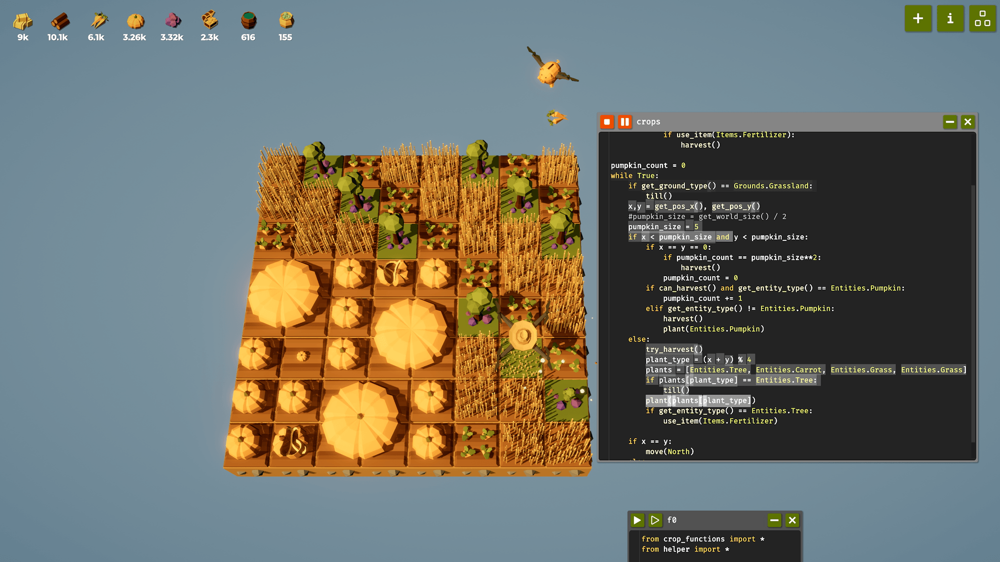
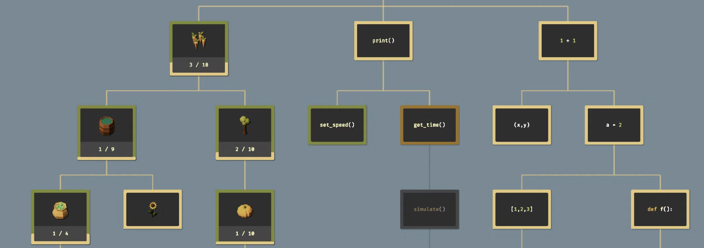
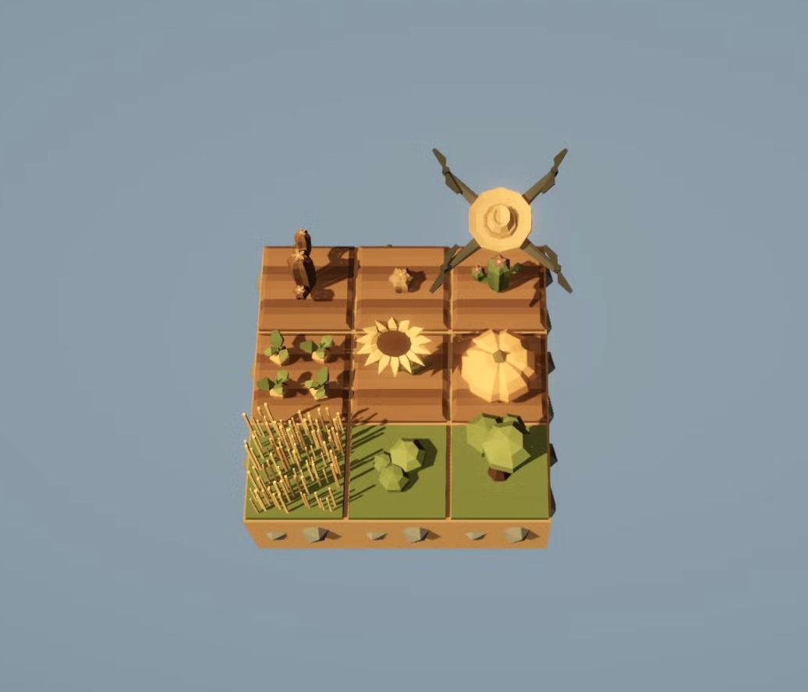

# 🌾 Learn Programming in a Fun Way — *The Farmer Was Replaced*



I recently discovered a game called [**The Farmer Was Replaced**](https://store.steampowered.com/app/2060160/The_Farmer_Was_Replaced/), and I think it’s one of the most fun and accessible ways to start learning programming.

In this game, you control a **drone** managing a **grid-based farm** — planting, watering, harvesting, trading, and unlocking new technologies, all through the **code you write**.

The entire world operates by your scripts, making it a playful yet surprisingly deep introduction to programming logic.

---

## 🧠 Why It’s Great for Learning Programming

### ⚙️ Script-Based Automation

You start with basic actions like:

```python
move()
plant()
harvest()
use_item()
```

and use them to build simple routines — planting seeds, watering crops, or gathering harvests.



As you collect more resources, you unlock *abilities* in your code — such as variables, mathematical operations, loops (`for` / `while`), conditionals (`if`), functions (`def`), imports, and data structures like **lists** and **dictionaries**.

These upgrades let you write more elegant, efficient, and reusable code.
Better yet, they **mirror Python’s core syntax**, helping you gain a practical and intuitive grasp of real programming concepts.

---

### 🌱 Varied Crop Mechanics

At first, you’ll plant and harvest basic crops — **Grass**, **Bushes**, **Trees**, and **Carrots** — to unlock new coding abilities.



As the game progresses, you’ll encounter more complex crops, each requiring a unique strategy to maximize yield:

* **🎃 Pumpkins** — *Multi-plot states*: grouped pumpkins merge into larger ones.
* **🌵 Cactus** — *Sorting logic*: arranging by height leads to better results.
* **🌾 Polyculture** — *Dynamic planting*: certain crops thrive when placed next to others.

This is where the real fun begins — you’ll find yourself experimenting with **data structures and algorithms** to automate smarter and more creative farms.

---

### 🔓 Tech Unlocks and Progression

As your farm becomes more automated and productive, you’ll unlock new challenges and tools:

* 🌀 **Mazes** — Navigate complex mazes until treasure is found (perfect for learning **pathfinding algorithms**).
* 🦖 **Dinosaur** — Collect apples while avoiding your own growing tail — basically a programmable version of *Snake*.
* 🪛 **Debug** — Inspect and improve your own scripts, just like in real-world programming.


Each new unlock gives you a new way to think like a programmer — by breaking down problems into logic, patterns, and automation.

---

## 💬 Final Thoughts

I’ve found a lot of joy in this game so far — both as a player and as a programmer. It’s a rare example of learning through genuine **play**, where code becomes a creative tool rather than just syntax.

I’m currently working on a **blog series** that dives deeper into the game’s programming lessons — short essays exploring how concepts like **loops**, **conditionals**, and **A*** pathfinding appear naturally through gameplay, along with **reusable scripts and algorithm tips** to make your farm smarter and more autonomous.

If you’re curious, check out the game on [Steam](https://store.steampowered.com/app/2060160/The_Farmer_Was_Replaced/) — it’s on sale right now.
And stay tuned for the upcoming posts in this series!

---

## ✍️ Author

Created by **[Xuyang Han]**

Explore more at [Backend Development Roadmap](https://github.com/xuyangHan/RoadToBackendMastery) if you’re interested in learning Backend Development in a structured learning path.
