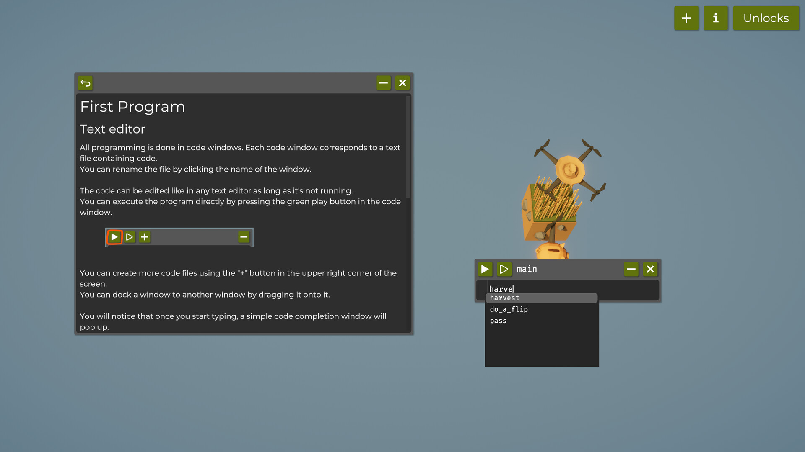

# 🌾 Learn Programming Basics in *The Farmer Was Replaced*

If you’re curious about programming but don’t want to start with dry tutorials, [**The Farmer Was Replaced**](https://store.steampowered.com/app/2060160/The_Farmer_Was_Replaced/) is a surprisingly fun way to learn.

You control a **drone** that automates a farm — planting, watering, harvesting, and managing crops through simple code.  

Let’s explore how the game gradually introduces real programming concepts.

---

## 🧠 Three Methods to Start

At the beginning, your drone only has a **1×1 field** and three basic commands to experiment with:

```python
harvest()
do_a_flip()
pet_the_piggy()
```

Try running each of them one by one — or all together — and **watch what happens**.
This helps you get a feel for how the game executes your script **line by line**, and how your drone responds to each command.



It’s a simple start, but it’s the foundation of how programming works:
every instruction runs in order, top to bottom, and you’ll soon be chaining them together to make your drone truly autonomous.

---

## 🔁 The While Loop

The first major unlock is the `while` loop — it lets your drone repeat actions continuously.

```python
while True:
    harvest()
```

### 💡 Tips

* A `while` loop keeps running **as long as its condition is `True`**.
  That means if you write `while True:`, your drone will **never stop** — it’ll keep repeating the same actions forever (or until you stop the script manually).

* As your farm expands, make sure your drone **returns to its original position** before repeating its routine.
  This ensures it keeps looping efficiently instead of wandering off into the field.

Think of this as your drone’s **main program** — the **brain** that keeps everything running smoothly.

---

### ⚙️ Some Upgrades: Speed and Efficiency

As you progress, your code execution will speed up.
That doesn’t mean you need to change the code — it’s like your drone’s “CPU” just got faster.
It’s a good reminder that optimization isn’t always about rewriting logic; sometimes it’s just about efficiency improvements under the hood.

---

## ⚖️ The If Statement

Now things get interesting — you unlock **conditional logic**.

```python
while True:
    if can_harvest():
        harvest()
```

Instead of blindly repeating, your drone now makes **decisions**.
This is one of the biggest conceptual leaps in programming:

> “Don’t just do things — think before you act.”

---

## 🌱 Crop Expansions

With more resources, you’ll gradually expand the farm: 1×1 → 1×3 → 3×3 → 4×4.

Now you’ll also unlock movement commands: `move(North)`, `move(East)`, etc.
Interestingly, if you tell your drone to move outside the map, it’ll **wrap around** to the other side — not crash!

That’s different from normal programming, where going out of bounds usually causes an error.

---

## 🧩 Debugging and Utility Functions

As your code grows, you’ll need ways to **inspect** what’s going on.
The game introduces some “debugging” methods:

* `get_pos_x()` / `get_pos_y()` → get your drone’s current coordinates.
* `get_entity_type()` / `get_ground_type()` → check what’s around or under your drone.

These functions help your drone **understand its environment** — a critical step for smarter automation.

---

## 🥕 Various Crops Unlocked

As the game progress, you’ll have access to multiple crops — **grass**, **bushes**, and **carrots**.

But carrots need extra steps:

* You must **till the soil** before planting.
* You’ll also need **hay and wood** as resources.

Here’s a good challenge:
Let’s automate a small farm with two rows of carrots, one row of bushes, and one row of grass.

```python
clear()

# --- Till two columns for carrots ---
for i in range(get_world_size()):
    till()
    move(North)
move(East)
for i in range(get_world_size()):
    till()
    move(North)
move(West) # return to orginal 


# --- Main farming loop ---
while True:
    # Column 1 – Carrots
    for i in range(get_world_size()):
        if can_harvest():
            harvest()
            plant(Entities.Carrot)
        move(North)
    move(East)

    # Row 2 – Carrots
    for i in range(get_world_size()):
        if can_harvest():
            harvest()
            plant(Entities.Carrot)
        move(North)
    move(East)

    # Row 3 – Bushes
    for i in range(get_world_size()):
        if can_harvest():
            harvest()
            plant(Entities.Bush)
        move(North)
    move(East)

    # Row 4 – Grass
    for i in range(get_world_size()):
        if can_harvest():
            harvest()
        move(North)
    move(East)
```

---

## 📋 Introducing Lists

The above code works, but it’s **hardcoded** — if your layout changes, you’ll need to rewrite everything.

Instead, let’s define what to plant in each column using a **list**.

```python
crops = [Entities.Carrot, Entities.Carrot, Entities.Bush, Entities.Grass]

while True:
    for i in range(len(crops)):
        crop = crops[i]
        
        for i in range(get_world_size()):
            if can_harvest():
                harvest()
                plant(crop)
            move(North)
        move(East)
```

Now your logic becomes **dynamic** — just update the list, and the drone automatically adapts.

---

## 🧱 Functions and Imports

Once you unlock `def`, things get powerful.
If you find yourself repeating code (like planting a full column), wrap it in a **function**.

```python
def farm_column(crop):
    for i in range(get_world_size()):
        if can_harvest():
            harvest()
            plant(crop)
        move(North)
    move(East)
```

Then your main loop becomes beautifully clean:

```python
while True:
    for crop in [Entities.Carrot, Entities.Carrot, Entities.Bush, Entities.Grass]:
        farm_column(crop)
```

You can even move these helper functions to another file — say, `farm_utils.py` — and import them:

```python
from farm_utils import plant_crop_column
```

That’s how you start writing **modular code** — reusable, organized, and scalable.

``` python

def till_column(n):
    # Till n columns 
    for _ in range(n):
        for i in range(get_world_size()):
            till()
            move(North)
        move(East)
    for _ in range(n):
        move(West)


def plant_crop_column(crop_type):
    """Plant one full column of a specific crop"""
    for _ in range(get_world_size()):
        if can_harvest():
            harvest()
            plant(crop_type)
        move(North)

# --- Main Program ---
import farm_utils

clear()
farm_utils.till_column(2)

while True:
    for crop in [Entities.Carrot, Entities.Carrot, Entities.Bush, Entities.Grass]:
        farm_utils.plant_crop_column(crop)
        move(East)

```

---

## 💬 Final Thoughts

By this point, you’ve already touched on some **core programming concepts**:

* Loops
* Conditionals
* Lists
* Functions
* Imports and modularity

And you learned them all while running a cute little farm.

Let your drone run for a while — gather more resources, and get ready for the next chapter: **advanced crop logic and automation strategies**.

Stay tuned 🌾
