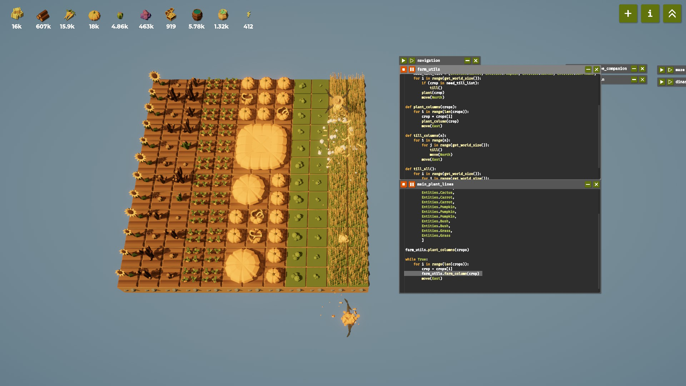
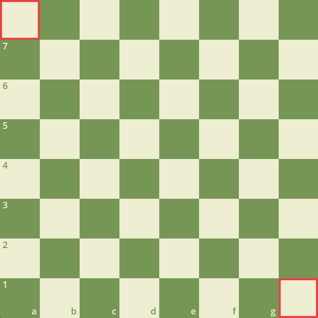
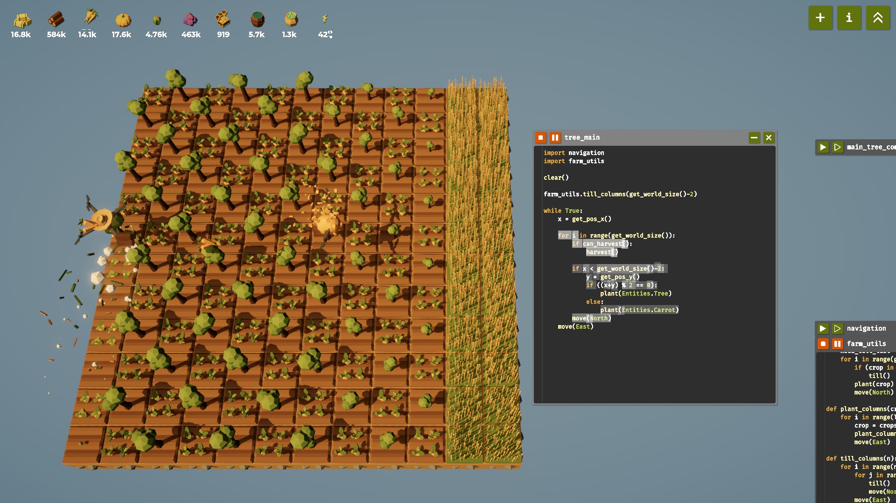
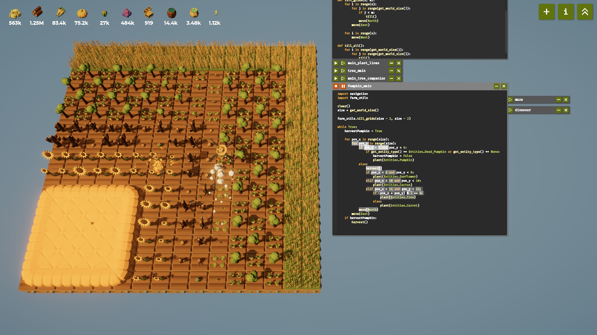

# 🌱 Crop Logic for Trees and Pumpkins in *The Farmer Was Replaced*

## Recap

In the [previous post](00_Basics.md), we started automating our basic farm — planting crops in simple rows and loops.
By now, you’ve probably unlocked more **resources** and **programming abilities**, and your code might be getting a bit repetitive.

Let’s clean that up by **refactoring** your farming logic into reusable helper functions inside `farm_utils`.

### 🧩 Code Refactoring

Here are some useful helper methods to make your code cleaner and more modular:

```python
def farm_column(crop):
    can_plant_list = [None, Entities.Dead_Pumpkin, Entities.Grass]
    for i in range(get_world_size()):
        if can_harvest():
            harvest()
        if get_entity_type() in can_plant_list:
            plant(crop)
        move(North)


def plant_column(crop):
    need_till_list = [Entities.Carrot, Entities.Pumpkin, Entities.Cactus, Entities.Sunflower]
    for i in range(get_world_size()):
        if crop in need_till_list:
            till()
        plant(crop)
        move(North)


def plant_columns(crops):
    for i in range(len(crops)):
        crop = crops[i]
        plant_column(crop)
        move(East)
```

These functions help separate your logic:

* `farm_column()` → handles harvesting and replanting for one column
* `plant_column()` → prepares and plants an entire column
* `plant_columns()` → builds multiple columns side by side


### 🚜 Applying It to a 12×12 Farm

Here’s how you can use the refactored functions to manage a medium-sized, diverse farm:

```python
import farm_utils

clear()

crops = [
    Entities.Sunflower, 
    Entities.Cactus, 
    Entities.Cactus, 
    Entities.Carrot, 
    Entities.Carrot, 
    Entities.Pumpkin, 
    Entities.Pumpkin, 
    Entities.Pumpkin, 
    Entities.Bush, 
    Entities.Bush, 
    Entities.Grass, 
    Entities.Grass
]

farm_utils.plant_columns(crops)

while True:
    for crop in crops:
        farm_utils.farm_column(crop)
        move(East)
```



With this setup:

* You can **easily adjust the layout** of your farm by changing the `crops` list.
* Each column automatically handles its own planting and harvesting logic.
* The code is much more **readable**, **modular**, and ready for advanced automation (like pathfinding or conditional replanting).

---

## 🌳 Trees

At this stage, you can already plant crops in rows and harvest them efficiently.
But you might notice that **resource generation feels slow** — for instance, harvesting wood from bushes doesn’t give you much yield.

That’s because the game introduces **special growth rules** to make certain planting patterns more efficient.
For example, **trees** are far more rewarding than bushes — but only when planted **strategically**.

### 🧠 Tree Growth Rule

Trees produce the best yield **when there are no other trees adjacent to them**.
In other words, spacing them out increases efficiency.

A smart layout would look like a **chessboard pattern**, where trees are planted on alternating tiles:



If you think about the coordinates, every “dark” tile on a chessboard shares the same property:

```python
(x + y) % 2 == 0
```

So, we can use this rule to decide where to plant trees.

### 🪓 Implementation

Let’s apply that logic — plant trees on “dark” tiles (where `x + y` is even), and carrots on the “light” ones.
You’ll also need to leave **two lines for grass**, since carrots require grass as a base crop.

```python
import farm_utils

clear()

farm_utils.till_columns(get_world_size() - 2)

while True:
    x = get_pos_x()
    
    for i in range(get_world_size()):
        if can_harvest():
            harvest()
        
        if x < get_world_size() - 2:
            y = get_pos_y()
            if (x + y) % 2 == 0:
                plant(Entities.Tree)
            else:
                plant(Entities.Carrot)
        move(North)
    move(East)
```

```python
# farm_utils.py
def till_columns(n):
	for i in range(n):
		for j in range(get_world_size()):
			till()
			move(North)
		move(East)
	for i in range(n):
		move(West)
```



### 🌲 Result

With this simple pattern, your drone will automatically maintain a **checkerboard-style forest**,
producing **wood at a much higher rate** — a crucial step for scaling your automation and unlocking more advanced crops later.

---

## 🎃 Pumpkins

Just like when harvesting wood, you can simply plant pumpkins in lines and let the program run.
But if you want to **maximize your yield**, you’ll need to take advantage of the **unique growth rules** of pumpkins.

### 🧩 Pumpkin Growth Rule

What makes pumpkins special is that when you plant them in **adjacent `n × n` clusters**, they **merge into larger pumpkins**, and their yield grows **exponentially**.

So instead of planting in straight rows, it’s smarter to **plant pumpkins in square blocks**.
You can then surround them with other crops — such as **trees and carrots** in a chessboard pattern — to balance your resource generation.

### 💀 Dead Pumpkins

There’s one tricky detail: pumpkins have about a **20% chance to become Dead Pumpkins**.
When that happens, the merged pumpkin group can’t fully form, leading to much lower yields.

To handle this, we can introduce a simple flag variable:

```python
harvestPumpkin = True
```

At the start of each round, set it to `True`.
As the drone traverses the pumpkin field, if it encounters a **Dead Pumpkin**, change the flag to `False` and **replant** that pumpkin.

Once the drone finishes scanning the entire batch and **returns to (0,0)** — if no dead pumpkins were found — we know the large pumpkin is ready for harvest!

### 🪄 Implementation

Here’s how you can combine both ideas — square planting and dead-pumpkin detection — into one automation routine:

``` python
import farm_utils

clear()
size = get_world_size() 

# Till the land except for the outermost boundary.
farm_utils.till_grids(size - 2, size - 2)

while True:
	# Assume all pumpkins are healthy at the beginning of each cycle.
	harvestPumpkin = True

	for pos_x in range(size):
		for pos_y in range(size):
			# Inner 6x6 area — main pumpkin zone.
			# Pumpkins grow best in adjacent square patterns to form larger ones.
			if pos_x < 6 and pos_y < 6:
				# If the cell is empty or contains a dead pumpkin,
				# mark that we shouldn't harvest yet and replant it.
				if get_entity_type() == Entities.Dead_Pumpkin or get_entity_type() == None:
					harvestPumpkin = False
					plant(Entities.Pumpkin)
			# Outer regions — plant different crops in layers.
			else:
				harvest() # Harvest any mature crops before replanting.
				if pos_x < 8 and pos_y < 8:
					plant(Entities.Sunflower)
				elif pos_x < 10 and pos_y < 10:
					plant(Entities.Cactus)
				elif pos_x < 14 and pos_y < 14: # alternate trees and carrots in a checkerboard pattern.
					if (pos_x + pos_y) % 2 == 0:
						plant(Entities.Tree)
					else:
						plant(Entities.Carrot)
			move(North)
		move(East)
	# After scanning the entire field:
	# If no dead pumpkins were found, the large pumpkin is ready — harvest it.
	if harvestPumpkin:
		harvest()
```

``` python
# farm_utils.py
def till_grids(n, m):
	for i in range(n):
		for j in range(get_world_size()):
			if j < m:
				till()
			move(North)
		move(East)
	for i in range(n):
		move(West)
```



---

## 💬 Final Thoughts

By now, you’ve learned how to plant **smartly** — organizing your fields to grow trees, carrots, and pumpkins in efficient patterns. You’ve also seen how to use conditionals to handle special cases, like detecting and replanting dead pumpkins for maximum yield.

In the next post, we’ll start taking advantage of **data structures** to push your automation even further — optimizing how your drone stores, tracks, and harvests crops such as pumpkins and cacti with even greater precision.

Stay tuned 🌱
