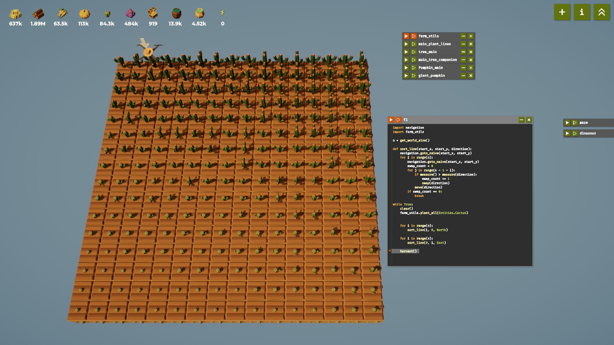

# 🌱 Crop Logic for Pumpkins and Cactus in *The Farmer Was Replaced*

## Recap

If you’ve been following along, you already know [**The Farmer Was Replaced**](https://store.steampowered.com/app/2060160/The_Farmer_Was_Replaced/) isn’t just a cozy farming simulator — it’s a fun, visual way to **learn programming through automation**.

So far, we’ve written scripts that taught our drone how to plant efficiently — arranging trees, carrots, and pumpkins in smart patterns for maximum yield.


In this post, we’ll start **diving deeper into logic and data structures**, stepping up from simple loops and conditionals to smarter ways of managing your farm.

---

## Revisit: Planting Pumpkins

In the previous blog, we learned how to plant pumpkins in square formations and used a boolean variable `harvestPumpkin` to decide whether a pumpkin batch was ready to harvest.

That approach works — but it’s not very efficient. The drone spends a lot of time flying over **already mature pumpkins**, scanning the entire field just to confirm readiness. All that unnecessary movement slows everything down.

To fix this, we’ll start using **data structures** (like lists) to track exactly where re-planting is needed. This way, the drone can focus only on the cells that matter — saving time and energy every round.

### Building a Smarter Navigation: `goto_naive()`

Before we dive into the logic of selective replanting, we’ll need one key helper: a navigation utility that lets the drone **move directly to any position** on the grid.

Up until now, the drone has simply followed a fixed scanning pattern — line by line, across the entire field. But to let it jump straight to a specific coordinate, we need a new function:

```python
def goto_naive(x_target, y_target):
	n = get_world_size()
	curX = get_pos_x()
	curY = get_pos_y()

	# Calculate horizontal distance and direction (shortest path)
	dx = (x_target - curX) % n

	# If dx <= n/2, move East dx steps; otherwise move West (n - dx) steps
	if dx <= n // 2:
		steps_x = dx
		dirX = East
	else:
		steps_x = n - dx
		dirX = West

	# Calculate vertical distance and direction (shortest path)
	dy = (y_target - curY) % n

	# If dy <= n/2, move North dy steps; otherwise move South (n - dy) steps
	if dy <= n // 2:
		steps_y = dy
		dirY = North
	else:
		steps_y = n - dy
		dirY = South

	# Move step by step, alternating between X and Y directions
	while steps_x > 0 or steps_y > 0:
		# Prioritize the direction with more remaining steps
		if steps_x >= steps_y and steps_x > 0:
			move(dirX)
			steps_x -= 1
		elif steps_y > 0:
			move(dirY)
			steps_y -= 1
```

This function determines the **shortest path** on a wrap-around map — meaning the drone can “teleport” efficiently across edges instead of looping through the entire grid.

It’s a small improvement, but it unlocks a big step forward: **direct, data-driven navigation**. And that’s exactly what we’ll need for smarter harvesting strategies.

---

### 🌟 Planting a Giant Pumpkin

Let’s say we have an **12×12 pumpkin patch**, and our goal is to grow a **giant pumpkin**.

Instead of letting the drone scan the entire field every round (which wastes time flying over already-mature pumpkins), we can **use a list to track which positions still need attention**.

**How it works:**

1. **First round of planting:**

   * All positions in the patch need planting, so we add every coordinate `(x, y)` to a list.
2. **Subsequent rounds:**

   * Instead of visiting the entire grid again, the drone only checks the positions in the list.
   * If a dead pumpkin is found, we re-plant it.
   * If the pumpkin is fully grown, we remove that coordinate from the list.
3. **Harvest:**

   * Once the list is empty, all pumpkins are mature. The drone can harvest the giant pumpkin and return to `(0, 0)` to start the next round.

This approach **minimizes unnecessary movement** and demonstrates how data structures like lists can make your code more efficient and dynamic.

---

Here’s an example implementation in Python:

```python
import navigation
import farm_utils

clear()
size = 12
set_world_size(size)

farm_utils.till_all()

while True:
	pumpkin_positions = []
	
	# Initialize list of all positions in the 8x8 patch
	for x in range(size):
		for y in range(size):
			navigation.goto_naive(x, y)
			use_item(Items.Water)
			if get_entity_type() in [None, Entities.Dead_Pumpkin]:
				plant(Entities.Pumpkin)
				pumpkin_positions.append((x, y))
	
	while pumpkin_positions:
		for pos in pumpkin_positions[:]:  # iterate over a copy since we may remove items
			x, y = pos
			navigation.goto_naive(x, y)
			entity = get_entity_type()
			if entity == Entities.Dead_Pumpkin or entity == None:
				use_item(Items.Water)
				plant(Entities.Pumpkin)
			elif entity == Entities.Pumpkin and can_harvest():
				# Already mature, remove from list
				pumpkin_positions.remove(pos)
	
	# Return to starting point
	# Harvest the giant pumpkin
	navigation.goto_naive(0, 0)
	harvest()
```


**Highlights:**

* `pumpkin_positions` acts as a **dynamic checklist**.
* Only positions that require action are visited each round.
* Once the patch is fully grown, the drone can harvest efficiently.

---

## 🌵 Cactus

Next, let’s tackle **cactus planting**. Cacti are tricky because they have a **size-based order requirement** to maximize your harvest.

According to the game’s description:

> A cactus is considered **in sorted order** if:
>
> * All neighboring cacti to the **North and East** are fully grown and **larger or equal in size**.
> * All neighboring cacti to the **South and West** are fully grown and **smaller or equal in size**.

When harvesting, you want to **harvest n cacti simultaneously**, as this will give you `n**2 Items.Cactus` — so maintaining order is key!

A crucial in-game hint:

> *“If the rows are already sorted, sorting the columns will not unsort the rows.”*

This means we can **sort row by row first, then column by column**, which is simpler than trying to sort everything at once.

---

### Implementation Idea

We can implement this by:

1. Moving along each row, and swapping/replanting cacti to ensure they are in **ascending order**.
2. Then moving along each column, applying the same logic to ensure vertical order.
3. Repeat as necessary until the patch is fully sorted.

Here’s a simplified code sketch:

```python
import navigation
import farm_utils

n = get_world_size()

def sort_line(start_x, start_y, direction):
	navigation.goto_naive(start_x, start_y)
	for i in range(n):
		navigation.goto_naive(start_x, start_y)
		swap_count = 0
		for j in range(n - 1 - i):
			if measure() > measure(direction):
				swap_count += 1
				swap(direction) 
			move(direction)
		if swap_count == 0:
			break
			
while True:			
	clear()
	farm_utils.plant_all(Entities.Cactus) 
		
	
	for i in range(n):
		sort_line(i, 0, North)
	
	for i in range(n):
		sort_line(0, i, East)
	
	harvest()
```



**Notes:**

* Sorting **rows first** and then **columns** ensures that fixing one dimension doesn’t break the order of the other — as hinted in the game description.
* This approach implements the classic [**bubble sort**](https://www.geeksforgeeks.org/dsa/bubble-sort-algorithm/): the algorithm repeatedly compares each cactus with its neighbor and swaps them if they’re out of order. After every full pass, the largest cactus in that row (or column) “bubbles up” to its correct position.
* That’s why the function runs up to `n` passes. Each pass begins again from `(start_x, start_y)` and only needs to check the first `n - 1 - i` elements, since the remaining ones are already in place.
* You can repeat this process for larger fields or multiple rounds until all cacti are fully grown and neatly sorted in the correct order.

---

## 🌾 Final Thoughts

At this stage, our farm is no longer just a patch of soil — it’s a living system guided by algorithms.

From pumpkins to cacti, we’ve moved from **manual repetition** to **data-driven decision-making**:

* The pumpkin logic showed how lists can act as memory — letting our drone focus only where action is needed.
* The cactus logic introduced sorting and iteration, transforming a patch of plants into a grid that behaves like a dataset.

What started as “plant, water, harvest” has become a lesson in **state management, optimization, and algorithmic design**. And that’s what makes *The Farmer Was Replaced* special: every improvement on the farm mirrors a fundamental programming idea.

In the next posts, we’ll explore how to combine these ideas to make the drone even more autonomous.

Because the real goal isn’t just to farm better.
It’s to **teach the farmer to think like a programmer.**

Stay tuned 🌱