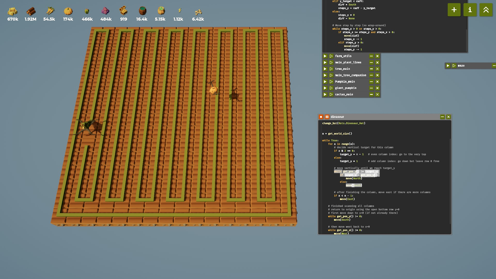
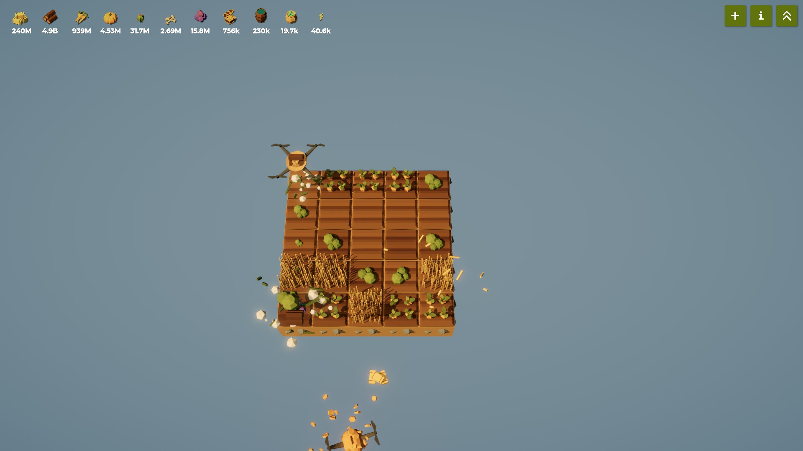
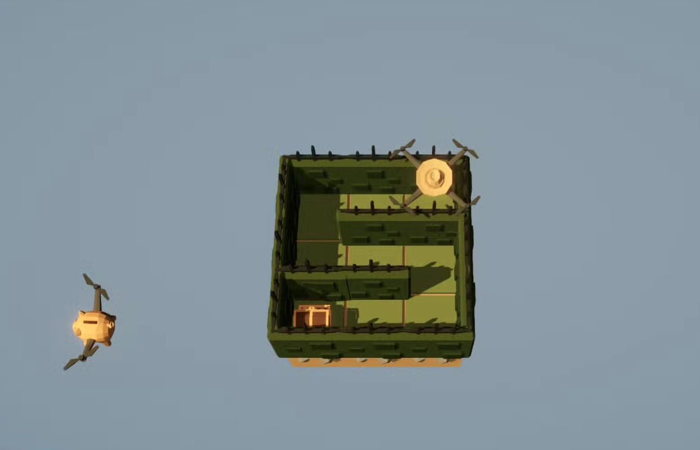
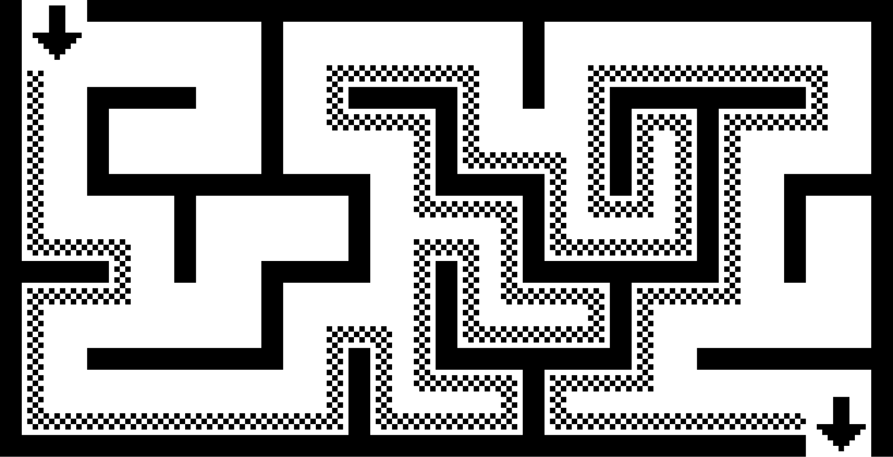

# 🌱 Solving Maze and Dinosaur in *The Farmer Was Replaced*

## Recap

If you’ve been following along, you already know that [**The Farmer Was Replaced**](https://store.steampowered.com/app/2060160/The_Farmer_Was_Replaced/) isn’t just a cozy farming simulator — it’s a visual sandbox for **learning automation and programming logic**.

So far, we’ve written scripts that let our drone plant crops efficiently — arranging trees, cactus, and pumpkins in smart, algorithmic patterns to maximize yield.


In this post, we’ll move beyond farming and explore new puzzles that push our logical thinking even further — starting with the **Dinosaur Hat challenge**, and later venturing into **maze solving**.

---

## 🦖 Dinosaur Mode

In this puzzle, you can equip the **Dinosaur Hat** to transform into a dinosaur with a growing tail:

```python
change_hat(Hats.Dinosaur_Hat)
```

Your goal? Eat the randomly spawned **apple** on the farm.

Just like in the classic **Snake** game, each apple you eat makes your tail grow longer — and speeds up your movement. The rule is simple but unforgiving:
👉 **You can’t collide with your own tail.**

The longer your tail grows, the higher your score — or in this case, the more rewards you earn:

> Each full round gives you *n² × Items.Bone* at harvest.

### 🧩 The Idea: A Safe, Predefined Path

When you first encounter this challenge, a simple but powerful idea might come to mind:

> Instead of chasing the apple directly, what if the dinosaur always follows a **pre-defined safe route** that covers the entire farm?

That’s exactly the concept behind a **[Hamiltonian path](https://en.wikipedia.org/wiki/Hamiltonian_path)** — a path that visits every tile on a grid exactly once.

In our case, we don’t need to compute such a path dynamically (which is a hard algorithmic problem).
We can design one manually — a repeating, snake-like traversal pattern that guarantees full coverage.



### 🧠 Designing the Traversal Pattern

Let’s make this concrete by setting a manageable grid size:

```python
set_world_size(8)
```

A full traversal of a large 32×32 field could take over 30 minutes — so an 8×8 grid makes experimentation much faster. (Though yes, a full 32×32 sweep can yield *millions of bones* if you’re patient!)

Here’s the plan for our route:

* The dinosaur moves **column by column**, alternating directions.
* **Even-numbered columns** (0, 2, 4, …) go all the way **up to the top**.
* **Odd-numbered columns** (1, 3, 5, …) come **down to the bottom − 1**, leaving the very bottom row free, making that open bottom row acts as a **return path** to the origin (0, 0).
* When you reach the rightmost edge, move along the bottom back home.

This creates a **looping, Hamiltonian-style route** that never crosses itself — a perfect safety net for our growing dinosaur.

### 🧾 Code Outline

```python
import navigation

clear()

change_hat(Hats.Dinosaur_Hat)
n = get_world_size()

while True:
	for x in range(n):
		# decide vertical target for this column
		if x % 2 == 0:
			target_y = n - 1   # even column index: go to the very top
		else:
			target_y = 1       # odd column index: go down but leave row 0 free
	
		# move vertically until we reach target_y
		while get_pos_y() != target_y:
			if target_y > get_pos_y():
				navigation.dinosaur_safe_move(North)
			else:
				navigation.dinosaur_safe_move(South)
	
		# after finishing the column, move east if there are more columns
		if x < n - 1:
			move(East)
	
	# finished scanning all columns
	# return to origin using the open bottom row y=0
	# first move down to y=0 (if not already there)
	while get_pos_y() != 0:
		navigation.dinosaur_safe_move(South)
	
	# then move west back to x=0
	while get_pos_x() != 0:
		navigation.dinosaur_safe_move(West)
	
	# now at (0,0)
```

``` python
# navigation.py
def dinosaur_safe_move(direction):
	# Move in the given direction if possible.
	# If movement is blocked, temporarily change hats as a workaround.
	
	if can_move(direction):
		move(direction)
	else:
		change_hat(Hats.Carrot_Hat)
		change_hat(Hats.Dinosaur_Hat)
```

This deterministic route ensures the dinosaur always has a valid move, regardless of where apples spawn.

### 🔍 Next Steps

This strategy is reliable but not optimal — especially on larger farms.
Possible improvements include:

* **Adaptive pathing:** Instead of always traversing the entire field, detect where the next apple will spawn and shorten the path dynamically.
* **Early turns:** If you can confirm there’s a clear path back home, you can allow the dinosaur to “cut corners” safely.

We’ll revisit these optimizations later. For now, enjoy watching your pixelated reptile devour apples, grow endlessly, and harvest a *mountain of bones*. 🦴

--- 

## 🧪 Maze Prep

Before we dive into solving the **maze puzzle**, let’s cover a few essential preparations — specifically, how to **unlock the maze** and gather the materials required for it.

### 1. Unlocking the Maze: The Role of *Weird Substance*

To generate a maze, you’ll need a special material called **Weird_Substance**, which can be crafted indirectly through **Fertilizer**.

Here’s how the game describes it:

> “Fertilizer can make plants grow instantly.
> `use_item(Items.Fertilizer)` reduces the remaining growing time of the plant under the drone by 2 seconds.
> This has some side effects — plants grown with fertilizer will be *infected*.
> When an infected plant is harvested, half of its yield turns into `Items.Weird_Substance`.”

In other words:

* **Fertilizer** accelerates plant growth,
* but **infects** the plant,
* producing **Weird_Substance** upon harvest.

That’s a key resource for unlocking **Mazes**, so we’ll automate its generation next.

### 2. Automating *Weird_Substance* Production

Here’s a simple farming loop that continuously grows and harvests **Trees** — using fertilizer each time to guarantee infection and Weird_Substance yield:

```python
while True:
    navigation.goto_naive(0, 0)
    harvest()
    use_item(Items.Water)
    plant(Entities.Tree)
    use_item(Items.Fertilizer)
```

This alone already provides a reliable supply.
But we can go a step further and **boost efficiency** with another mechanic you’ve likely unlocked by now.

### 3. Boosting Yield with *Polyculture*

Once the **Polyculture** upgrade is available, plants will yield **extra resources when planted alongside compatible crops**.

You can find which plants go well together using:

```python
plant_type, (x, y) = get_companion()
```

This built-in function tells you:

* what type of **companion crop** to plant (`plant_type`), and
* at which **grid position** (`x, y`) it should go.

Companion preferences are usually one of:
`Entities.Grass`, `Entities.Bush`, `Entities.Tree`, or `Entities.Carrot`.

This mechanic synergizes perfectly with our Weird_Substance loop — giving you both *extra resources* and *faster regeneration*.

---

### 4. Putting It All Together

We’ll use a **small 3×3 or 5×5 farm** for quick cycling and efficiency.
Here’s the plan:

1. At **(0, 0)** — grow a Tree with Fertilizer (to trigger Weird_Substance generation).
2. After planting, call `get_companion()` to locate and plant the companion crop.
3. Visit that location, harvest any existing crop, and plant the new one.
4. Return to (0, 0) to harvest and repeat.

Here’s the full working loop:

```python
import navigation
import farm_utils

clear()
set_world_size(5)
farm_utils.till_all()

while True:
    navigation.goto_naive(0, 0)
    harvest()
    use_item(Items.Water)
    plant(Entities.Tree)
    use_item(Items.Fertilizer)
    
    pl, (x, y) = get_companion()
    navigation.goto_naive(x, y)
    harvest()
    plant(pl)
```

### 5. Why This Works

This setup forms a **micro feedback loop** — one of the core automation concepts in *The Farmer Was Replaced*.

* You grow → harvest → replant automatically.
* Each cycle yields both **crops** and **Weird_Substance**.
* The companion mechanic ensures **higher overall yield per cycle**.



In short: you’re turning a few lines of code into a **self-sustaining farm machine** that generates a lot Weird_Substance!

---

## 🧩 Maze

Now that we’ve stocked up enough **Weird_Substance**, it’s time to tackle one of the most interesting parts of *The Farmer Was Replaced*: the **Maze** puzzle.

### Creating the Maze

Based on the in-game descriptions, we can generate a maze using the following snippet:

```python
plant(Entities.Bush)
substance = get_world_size() * 2**(num_unlocked(Unlocks.Mazes) - 1)
use_item(Items.Weird_Substance, substance)
```

Here’s what’s happening:

* `plant(Entities.Bush)` fills the entire farm with bushes — these act as the maze’s **walls**.
* Then, `use_item(Items.Weird_Substance, substance)` carves out **walkable paths** through those bushes, forming a randomly generated maze.

The amount of Weird_Substance used scales with your progress:

* As you unlock more maze-related upgrades, the formula `2**(num_unlocked(Unlocks.Mazes) - 1)` makes the maze larger and more complex.

Once this step finishes, your farm transforms into a proper maze — with one treasure hidden somewhere deep inside.

Your next mission: **find the path and harvest the treasure**.



### 🧭 “Hand on the Wall” Rule

There are [many algorithms](https://en.wikipedia.org/wiki/Maze-solving_algorithm) to solve mazes — from depth-first search to A*, to more heuristic-based ones.
But in our case, we’ll start simple with a time-tested and intuitive approach: the **“Hand on the Wall” rule**.

Here’s the key insight from the game’s description:

> Mazes do not contain any loops unless you reuse the maze. So there is no way for the drone to end up in the same position again without going back.

That means our maze is **simply connected** — all walls form one continuous boundary, with no enclosed loops.
In such mazes, keeping one hand (say, your **right hand**) on the wall while walking guarantees you’ll eventually reach the goal.



That’s what we’ll code next.

### 💡 Coding the Maze Solver

We’ll implement this rule in three stages:

#### 1️⃣ Direction Helpers

We first need a way to manage directions — turning left, right, and keeping track of orientation.

```python
dirs = [East, South, West, North]
dirs_index = {East: 0, South: 1, West: 2, North: 3}

def get_right_dir(dir):
    return dirs[(dirs_index[dir] + 1) % 4]

def get_left_dir(dir):
    return dirs[(dirs_index[dir] - 1) % 4]
```

**What’s happening:**

* The list `dirs` defines a **clockwise order**: East → South → West → North.
* `get_right_dir(dir)` finds the next direction clockwise (i.e., a right turn).
* `get_left_dir(dir)` finds the next direction counterclockwise (i.e., a left turn).

This modular arithmetic (`% 4`) makes turning directions clean and cyclic — no messy if-else logic needed.

#### 2️⃣ Maze Generation

We can wrap the maze creation logic into a simple loop for repeated experimentation:

```python
clear()
n = get_world_size()

while True:
    # Fill everything with bushes
    plant(Entities.Bush)
    # Use Weird_Substance to carve the maze
    substance = get_world_size() * 2**(num_unlocked(Unlocks.Mazes) - 1)
    use_item(Items.Weird_Substance, substance)
```

Every run generates a new random maze, ensuring plenty of variety for testing your solver.

#### 3️⃣ Wall-Following Traversal

Now comes the fun part — **navigating the maze**.

```python
dir = North
while True:
    if can_move(get_right_dir(dir)):
        dir = get_right_dir(dir)
        move(dir)
    else:
        dir = get_left_dir(dir)
    if get_entity_type() == Entities.Treasure:
        harvest()
        break
```

Let’s unpack it step by step:

1. **Initialization**
   The drone starts facing `North`.

2. **Wall-Following Logic**
   At every step, the drone:

   * Checks if it can move **to the right** of its current facing direction.

     * If yes → it **turns right and moves forward**.
   * Otherwise → it **turns left**, keeping itself aligned with the wall.

     * (Notice that “turning left” here doesn’t move the drone — it just reorients it.)

   This pattern ensures the drone **sticks to one side of the maze wall**, never losing its way.

3. **Treasure Detection**
   Whenever the drone encounters `Entities.Treasure`, it simply:

   ```python
   harvest()
   break
   ```

   and ends the loop.

#### ✅ Putting It All Together

``` python
dirs = [East, South, West, North]
dirs_index = {East: 0, South: 1, West: 2, North: 3}

def get_right_dir(dir):
	return dirs[(dirs_index[dir] + 1) % 4]

def get_left_dir(dir):
	return dirs[(dirs_index[dir] - 1) % 4]

clear()
n = get_world_size()

while True:
	plant(Entities.Bush)
	substance = get_world_size() * 2**(num_unlocked(Unlocks.Mazes) - 1)
	use_item(Items.Weird_Substance, substance)
	dir = North
	while True:
		if can_move(get_right_dir(dir)):
			dir = get_right_dir(dir)
			move(dir)
		else:
			dir = get_left_dir(dir)
		if get_entity_type() == Entities.Treasure:
			harvest()
			break
```

So, in summary:

1. **Generate** the maze with bushes and Weird_Substance.
2. **Follow** one wall using simple directional logic.
3. **Harvest** the treasure once found.

This right-hand rule guarantees success in any **loop-free maze**, and it’s a perfect introduction to algorithmic thinking in automation — you’re not just solving the puzzle, you’re encoding a **general strategy**.

Congratulations — you’ve built your first autonomous maze-solving drone. 🚀

---

## 🌾 Final Thoughts

In this post, we explored two classic programming problems hidden inside The Farmer Was Replaced:
the Dinosaur game — inspired by Hamiltonian paths, and the Maze solver — powered by the simple but elegant wall-following rule.

Both are great examples of how fundamental algorithms can emerge naturally from gameplay.
You didn’t need advanced data structures or math-heavy pathfinding — just clear logic and consistent rules.

In the next post, things will scale up.
We’ll go from one drone solving puzzles to multiple drones working together — unlocking the Mega Farm and learning how to coordinate tasks, avoid conflicts, and think in terms of parallelism and multi-threading.

It’s where your farm — and your code — start feeling truly alive.

Stay tuned 🌱
