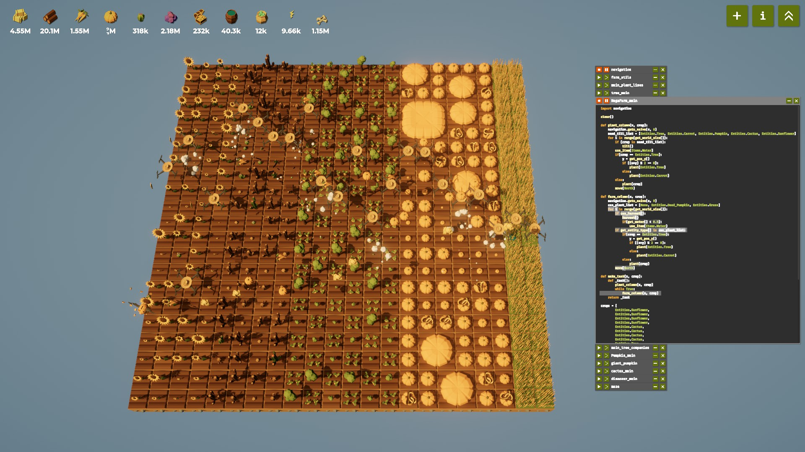
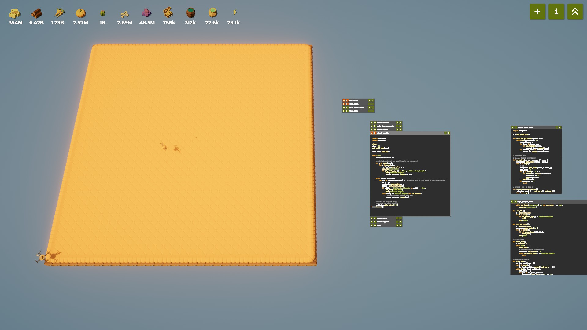
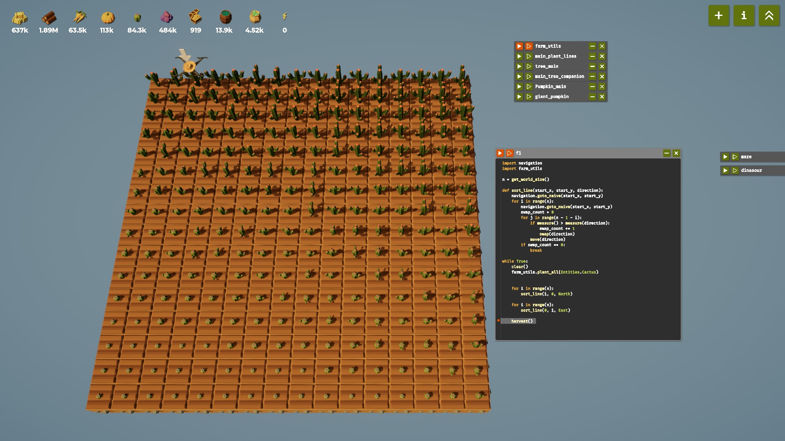

# 🌱 Use More Drones in *The Farmer Was Replaced*

## Recap

If you’ve been following along, you’ve already built a solid foundation — your drone can plant, harvest, and repeat tasks automatically.
So far though, all the logic has revolved around **a single worker** doing everything by itself. That’s fine for small farms, but as the world expands, one drone simply can’t keep up.

In this post, we’re taking the next big step — **introducing multiple drones** working together.
This is where programming meets real-world parallelism: you’ll learn the basics of **multithreading** through the lens of our robotic farmers.

By the end, you’ll have a whole fleet of drones — each responsible for its own column — farming side by side like a synchronized ballet of bots. 🤖🌾

---

## Understanding “Passing a Function” in Python

Before spawning your first drone army, let’s make sure you understand one key Python concept:
[**passing a function as a parameter**](https://www.geeksforgeeks.org/python/passing-function-as-an-argument-in-python/).

When you call:

```python
spawn_drone(task)
```

You’re not running the function yet — you’re **handing it over** to the drone so it can execute it later, independently.

If you were to write `spawn_drone(task())`, with parentheses, Python would **run `task()` immediately** before spawning, and the result (probably `None`) would be sent to the drone — not what we want.

So remember:

> `spawn_drone(task)` → gives the drone a job to run
> `spawn_drone(task())` → runs the job *yourself* right now and gives the drone nothing useful

This is the foundation of multi-drone control — giving each one a function, a purpose, and letting them work in parallel.

---

## 🌾 Crop Lines

Let’s revisit one of the earlier ideas — planting different crops line by line.
Previously, a **single drone** did all the heavy lifting: move, plant, harvest, repeat. It worked, but it was painfully sequential.

Now that we know how to **assign tasks to multiple drones**, we can scale that pattern horizontally:

> one drone per crop line.

Each drone will take charge of a single column, planting and harvesting that crop forever while the main farmer moves to the next line to deploy the next worker.



Here’s what that looks like in code:

```python
# task to farm a line, reading crop info from its current x position
def task():
	x = get_pos_x()
	crop = crops[x]
	plant_column(x, crop)
	while True:
		farm_column(x, crop)

# list of crops, one per column
crops = [
	Entities.Tree,
	Entities.Carrot,
	Entities.Pumpkin,
	Entities.Cactus,
	Entities.Sunflower,
	Entities.Grass,
	# ...
]

# assign one drone per crop line
for i in range(get_world_size()):
	if spawn_drone(task):
		move(East)  # move east to assign the next drone

# the main drone farms the last line itself
task()
```

Each `spawn_drone(task)` call **hands the function definition** to a new drone, which runs that logic independently.
Meanwhile, the main drone keeps sliding east, deploying more workers — until your entire field is buzzing with synchronized activity.

This is the farming world’s version of **multithreading** — all threads (drones) share the same logic but act on different data.

### 🧰 Inside `farm_utils.py`

To make the drones intelligent and flexible, we define reusable column operations that handle special cases — alternating trees, watering, and soil preparation.

```python
# farm_utils.py

def plant_column(x, crop):
	# Plant an entire column with a given crop.
	# Handles special planting rules for trees and sunflowers.
	
	need_till_list = [Entities.Tree, Entities.Carrot, Entities.Pumpkin, Entities.Cactus, Entities.Sunflower]
	
	for i in range(get_world_size()):
		# Some crops require tilling before planting
		if crop in need_till_list:
			till()
		
		# Always water before planting
		use_item(Items.Water)

		# Alternate trees and sunflowers in a checkerboard pattern
		if crop == Entities.Tree:
			y = get_pos_y()
			if (x + y) % 2 == 0:
				plant(Entities.Tree)
			else:
				plant(Entities.Sunflower)
		else:
			plant(crop)
		
		move(North)


def farm_column(x, crop):
	# Maintain and replant a crop column indefinitely.
	# Checks if harvestable, waters if dry, replants if empty or dead.
	
	can_plant_list = [None, Entities.Dead_Pumpkin, Entities.Grass]
	
	for i in range(get_world_size()):
		# Harvest if ready
		if can_harvest():
			harvest()
			# Check soil moisture before replanting
			if get_water() < 0.5:
				use_item(Items.Water)

		# Replant on empty, grass, or dead tiles
		if get_entity_type() in can_plant_list:
			if crop == Entities.Tree:
				y = get_pos_y()
				if (x + y) % 2 == 0:
					plant(Entities.Tree)
				else:
					plant(Entities.Sunflower)
			else:
				plant(crop)

		move(North)
```

By combining these two functions with multiple drones, you now have a **fully automated vertical farm** — every column runs independently yet contributes to the same ecosystem.
This is where your farm starts to feel alive: *each drone has a mind of its own, but all work toward a shared goal.*

---

## 🎃 Giant Pumpkin

Next, let’s revisit the **giant pumpkin task**, now using multiple drones.
The principle is similar to **crop lines**: we assign the first 31 lines to spawned drones, and the **main drone** handles the last line. This way, all drones collaborate to grow a 32×32 pumpkin efficiently.

```python
def drone_exec():
    # Task executed by each spawned drone.
    x = get_pos_x()            # Record starting column for this drone
    while True:
        plant_line()           # Plant and maintain the entire column

        # Return to bottom of column and wait until the pumpkin grows
        navigation.goto_naive(x, 0)
        while get_entity_type() == Entities.Pumpkin:
            pass              # Busy-wait until the giant pumpkin is harvested
```

### Deploy the drones

```python
# Spawn drones for all columns except the last
for i in range(n - 1):
    spawn_drone(drone_exec)  # Each drone will farm its column indefinitely
    move(East)               # Move main drone to the next column

# The main drone handles the final column
while True:
    navigation.goto_naive(n - 1, 0)
    plant_line()             # Maintain the last column

    # Check if the giant pumpkin is ready by comparing IDs
    while True:
        navigation.goto_naive(0, 0)
        if get_entity_type() == Entities.Pumpkin:
            id = measure()          # Measure pumpkin at bottom-left
            navigation.goto_naive(n - 1, n - 1)
            if id == measure():     # Compare with top-right pumpkin
                harvest()           # Giant pumpkin is ready
                break
```

> ⚠️ **Key idea**: spawned drones **wait at the bottom** until the giant pumpkin is fully formed.
> The **main drone** is responsible for **checking formation and harvesting**, so we avoid conflicts or duplicate harvesting.



### 🧰 Inside `farm_utils.py`

To keep drones efficient and reusable, we define helper functions for watering and column planting:

```python
def check_and_water():
    # Ensure the soil is hydrated before planting or harvesting.
    while num_items(Items.Water) > 0 and get_water() <= 0.75:
        use_item(Items.Water)

def plant_line():
    # Plant and maintain a full column until all pumpkins are mature.
    to_plant_positions = [(get_pos_x(), i) for i in range(n)]  # Track positions to visit

    while to_plant_positions:
        next_round = []  # Positions that need to be retried in the next round

        for pos in to_plant_positions:
            navigation.goto_naive(pos[0], pos[1])

            # Prepare soil if necessary
            if get_ground_type() == Grounds.Grassland:
                till()

            # Harvest if anything is there except Pumpkin
            if get_entity_type() != Entities.Pumpkin:
                harvest()

            # Plant or maintain pumpkin if it’s not ready
            if not can_harvest():
                next_round.append(pos)
                check_and_water()      # Ensure soil has enough water
                plant(Entities.Pumpkin) # Plant or replant

        to_plant_positions = next_round  # Repeat until all positions are done
```

✅ **Highlights of this approach**:

* Maintains a **dynamic list of positions**, retrying only where planting/harvesting is incomplete.
* Ensures each drone works independently but **collaborates indirectly** to form the giant pumpkin.
* Combines **soil management**, **planting**, and **harvesting** in a clean, reusable function.

---

## 🌵 Cactus Sorting

Now, let’s revisit the **cactus sorting** task.

Previously, we only had **one drone** sorting each row and column sequentially — a slow and repetitive process.
With **multiple drones**, we can now assign **one line per drone**, allowing the farm to **sort every row and column in parallel**.

The principle is the same as the previous two sections:

* Spawn drones to handle the first `n - 1` rows or columns.
* Let the **main drone** handle the final one.
* Synchronize all drones before moving to the next phase.

### 🧩 Drone Tasks

We define two separate drone tasks — one for sorting **rows**, one for **columns**.

```python
# 🪴 Task 1: Plant and sort each row
def drone_plant_and_sort_row():
    (start_x, start_y) = (get_pos_x(), get_pos_y())  # Remember starting position
    
    # Step 1: Plant cactus across this row
    for i in range(n):
        if get_ground_type() == Grounds.Grassland:  # Prepare soil if needed
            till()
        harvest()                                  # Clear any existing entity
        plant(Entities.Cactus)                     # Plant cactus
        move(East)                                 # Move to next tile
    
    # Step 2: Sort this row using bubble sort logic
    sort_line(start_x, start_y, East)


# 🌵 Task 2: Sort an existing column
def drone_sort_line():
    sort_line(get_pos_x(), get_pos_y(), North)
```

> 🧠 **Concept**:
>
> * The first task both **plants and sorts** (used for rows).
> * The second task **sorts only**, assuming crops are already planted (used for columns).

### 🚀 Deploy the Drones

Here’s how we orchestrate all drones to work together efficiently:

```python
while True:
    navigation.goto_naive(0, 0)
    
    # --- Phase 1: each drone plants and sorts one row ---
    drones = set()
    for i in range(n):
        drone = spawn_drone(drone_plant_and_sort_row)
        if not drone:
            # If no slot available, main drone does the task itself
            drone_plant_and_sort_row()
        else:
            drones.add(drone)
        move(North)  # Move to the next row

    # Wait for all drones to finish before moving on
    navigation.goto_naive(0, 0)
    wait_for_all_drones(drones)
    

    # --- Phase 2: each drone sorts one column ---
    for i in range(n):
        drone = spawn_drone(drone_sort_line)
        if not drone:
            drone_sort_line()
        else:
            drones.add(drone)
        move(East)  # Move to the next column

    # Wait again before harvesting
    wait_for_all_drones(drones)
    harvest()
```

🧩 **Key ideas**:

* After finishing one task, drones **disappear automatically**, freeing up capacity for the next batch.
* The **main drone acts as coordinator**, spawning new workers and waiting until all finish.
* The helper `wait_for_all_drones()` ensures synchronization — a critical step in multi-thread logic.



### 🧰 Inside `farm_utils.py`

Let’s look at the helper functions that make this process work smoothly.

```python
def wait_for_all_drones(drones_set):
    # Keep checking until all drones in the set have finished their tasks.
    while len(drones_set) > 0:
        removed_drones = []
        for drone in drones_set:
            if has_finished(drone):         # If this drone’s task is done
                removed_drones.append(drone)
        for removed_drone in removed_drones:
            drones_set.remove(removed_drone)
```

* Maintains a **set of active drones**.
* Continuously checks if any drone has finished (using `has_finished(drone)`).
* Removes completed drones from the set until the set becomes empty — i.e., all done.

### 🪄 Sorting Logic

The `sort_line()` function uses a **bubble sort** to organize entities in a line, comparing neighboring tiles using `measure()` and swapping when necessary.

```python
def sort_line(start_x, start_y, direction):
    # Bubble sort implementation to sort a line of crops.
    navigation.goto_naive(start_x, start_y)
    
    for i in range(n):
        navigation.goto_naive(start_x, start_y)
        swap_count = 0
        for j in range(n - 1 - i):
            if measure() > measure(direction):  # Compare with next tile
                swap_count += 1
                swap(direction)                 # Swap if out of order
            move(direction)                     # Continue along the line
        if swap_count == 0:
            break  # Stop early if already sorted
```

### ✅ Highlights of this approach

* **Parallel efficiency**: multiple drones now handle sorting simultaneously.
* **Reusable logic**: `sort_line()` and `wait_for_all_drones()` can be applied to other multi-drone farming tasks.
* **Clean synchronization**: using `wait_for_all_drones()` ensures no race conditions or premature harvesting.
* **Dynamic reuse**: drones vanish after finishing, allowing reuse in subsequent phases.

---

## Final Thoughts

In this post, we explored how **multiple drones** can collaborate to farm efficiently — a concept that mirrors real-world **parallelism and multithreading**.

By spawning a fleet of autonomous workers, each handling its own crop line, we transformed our single-drone logic into a distributed system. The coordination between these drones — waiting for signals, checking shared states (like the giant pumpkin), and dividing labor — is exactly how concurrent tasks operate in larger software systems.

The beauty of this approach lies in its simplicity: every drone runs the same function, yet together they form a **self-organizing system**. Tasks get done faster, responsibilities are isolated, and the overall process feels like watching a **synchronized ballet of bots** — elegant, efficient, and a little mesmerizing. 🤖🎃🌾

